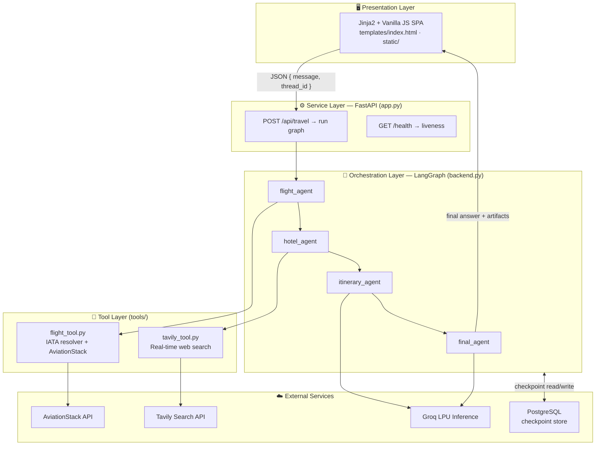
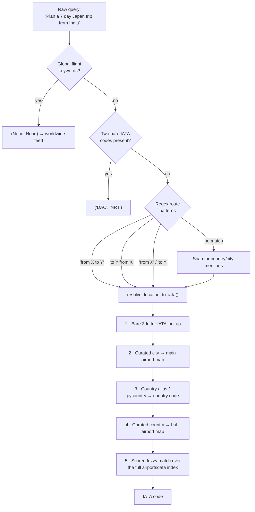

<div align="center">

# ✈️ VoyaGen AI

### A Multi-Agent Travel Planning System built on LangGraph

*Turn a single sentence — "Plan a 7-day Japan trip from India under ₹2 lakhs" — into a
grounded, budget-aware itinerary backed by live flight data and real-time web search.*

[](https://www.python.org/)
[](https://langchain-ai.github.io/langgraph/)
[](https://fastapi.tiangolo.com/)
[](https://www.postgresql.org/)
[](https://groq.com/)
[](https://www.docker.com/)
[](LICENSE)

</div>

---

## 📖 Table of Contents

- [Overview](#-overview)
- [Why This Project](#-why-this-project)
- [Key Features](#-key-features)
- [System Architecture](#-system-architecture)
- [The Agent Graph](#-the-agent-graph)
- [Pipeline & Data Flow at a Glance](#-pipeline--data-flow-at-a-glance)
- [State Design](#-state-design)
- [Deep Dive: The Flight Resolution Engine](#-deep-dive-the-flight-resolution-engine)
- [Tech Stack](#-tech-stack)
- [Project Structure](#-project-structure)
- [Getting Started](#-getting-started)
- [Configuration](#️-configuration)
- [Running the Application](#️-running-the-application)
- [Docker Deployment](#-docker-deployment)
- [API Reference](#-api-reference)
- [Example Walkthrough](#-example-walkthrough)
- [Design Decisions & Trade-offs](#-design-decisions--trade-offs)
- [Known Limitations](#️-known-limitations)
- [Roadmap](#-roadmap)
- [Contributing](#-contributing)
- [License](#-license)
- [Acknowledgements](#-acknowledgements)

---

## 🌍 Overview

**VoyaGen AI** is an end-to-end, production-shaped **multi-agent system** that plans complete
trips from a single natural-language request. Instead of dropping one monolithic prompt on a
language model and hoping for the best, VoyaGen decomposes travel planning into a **directed
graph of specialised agents**, each owning one responsibility, communicating through a shared,
typed, and **durably checkpointed** state object.

The result is an assistant that is:

- **Grounded** — flight information comes from a live aviation API and hotel information from
  real-time web search, not from the model's parametric memory.
- **Debuggable** — every intermediate artifact (raw flight results, raw hotel results, draft
  itinerary) is returned alongside the final answer, so any bad output can be traced to the
  exact node that produced it.
- **Resumable** — conversation state lives in PostgreSQL via LangGraph's checkpointer, so a
  `thread_id` survives process restarts, redeploys, and horizontal scaling.
- **Deployable** — a FastAPI service, a responsive front end, and a Docker image, all in one repo.

```
User: "Plan a complete 7 day Japan trip from India including
       flights, hotels and sightseeing under 2 lakhs"

                            ⬇

VoyaGen: 1. Trip Summary       4. Day-by-Day Itinerary
         2. Flight Information 5. Estimated Budget
         3. Hotel Suggestions  6. Final Recommendations
```

---

## 💡 Why This Project

Travel planning is a deceptively good benchmark for applied-AI engineering: it is
**multi-source** (flights, lodging, attractions, budget), **temporally grounded** (live
schedules), **constraint-driven** (budget, duration, origin), and **long-form** (the output is a
structured document, not a sentence). A single LLM call fails at it in predictable ways —
hallucinated flight numbers, invented hotel prices, itineraries that ignore the stated budget.

VoyaGen AI was built to explore three engineering questions:

| Question | How VoyaGen answers it |
| --- | --- |
| **How do you stop an LLM from inventing facts?** | Push every factual claim to a tool. The LLM is used only for *synthesis and formatting*, never for retrieval of flights or hotels. |
| **How do you keep a multi-step agent debuggable?** | Model the workflow as an explicit `StateGraph` with named nodes, and expose every intermediate field over the API. |
| **How do you make agent memory survive production?** | Replace in-memory state with a `PostgresSaver` checkpointer keyed by `thread_id`. |

---

## ✨ Key Features

| | Feature | Description |
| :-: | --- | --- |
| 🧠 | **Four-agent LangGraph pipeline** | `flight_agent → hotel_agent → itinerary_agent → final_agent`, each a pure function over shared state. |
| ✈️ | **Live flight data** | Real-time schedules, status, terminals, gates, and delay minutes from the AviationStack API. |
| 🗺️ | **NL → IATA resolution engine** | A hand-built, multi-strategy resolver that maps free text ("Japan", "Tokyo", "NRT", "from India to Japan") to airport codes — no LLM call required. |
| 🏨 | **Real-time hotel discovery** | Tavily web search returns current, cited lodging options with source URLs. |
| 💾 | **Durable conversation memory** | PostgreSQL-backed LangGraph checkpointing; threads persist across restarts and deployments. |
| ⚡ | **Fast LLM inference** | Groq LPU inference (`openai/gpt-oss-120b` by default, configurable via env). |
| 🖥️ | **Polished web UI** | Gradient-glass single-page front end with markdown rendering, thread persistence via `localStorage`, and loading/error states. |
| 🔌 | **Clean JSON API** | `POST /api/travel` returns the final answer *plus* every intermediate artifact and an LLM-call counter. |
| 📊 | **LangSmith tracing** | Optional, env-gated observability across the entire graph execution. |
| 🐳 | **Containerised** | Slim Python 3.11 image, Uvicorn entrypoint, ready for Render / Railway / Fly.io / ECS. |

---

## 🏛 System Architecture



The system is deliberately layered so that each concern can be tested and replaced in isolation:

1. **Presentation** — a dependency-free front end (no build step, no framework) that talks to one endpoint.
2. **Service** — FastAPI handles validation (`pydantic` models), error boundaries, and static/template serving.
3. **Orchestration** — LangGraph owns control flow, state reduction, and persistence.
4. **Tools** — plain Python functions with no LangChain coupling, so they are testable standalone
   (`python -m tools.flight_tool` runs its own smoke test).

---

## 🕸 The Agent Graph


### Node responsibilities

| Node | Input it reads | Tool / model | Output it writes |
| --- | --- | --- | --- |
| **`flight_agent`** | `user_query` | `search_flights()` → AviationStack | `flight_results` |
| **`hotel_agent`** | `user_query` | `tavily_search()` → Tavily | `hotel_results` |
| **`itinerary_agent`** | `user_query`, `flight_results`, `hotel_results` | Groq LLM, *"expert travel planner"* persona | `itinerary` |
| **`final_agent`** | all of the above | Groq LLM, *"professional travel booking assistant"* persona | final formatted `AIMessage` |

**Why two LLM nodes instead of one?** Separating *planning* from *presentation* keeps each
prompt short and single-purpose. The itinerary node reasons over raw, noisy tool output; the
final node reasons over an already-structured draft and is responsible only for the six-section
output contract (Trip Summary, Flights, Hotels, Day-by-Day, Budget, Recommendations). Splitting
them keeps each instruction set small enough that neither section-formatting nor
constraint-following has to compete for attention inside one prompt.

**Why is retrieval sequential rather than parallel?** Flights and hotels are independent, so
this pipeline is the natural candidate for a fan-out/fan-in refactor — see
[Roadmap](#-roadmap). The current linear graph was chosen first for deterministic, easily
traceable execution while the state contract was being stabilised.

---

## 🔄 Pipeline & Data Flow at a Glance

A wider view of the same graph — each agent, the tools/models behind it, how their outputs land
in the shared `TravelState`, and how that state is persisted:

<div align="center">
  
</div>

**Reading this diagram:**

- Every agent writes into the **same** `TravelState` object rather than passing messages
  point-to-point — this is what lets the final agent see the flight data fetched two steps
  earlier without any node re-fetching or re-deriving it.
- In the current implementation, `flight_agent` calls **AviationStack** and `hotel_agent` calls
  **Tavily Search**; `itinerary_agent` and `final_agent` are pure Groq LLM calls reasoning over
  state that already exists — no separate maps/places lookup is wired in yet (see
  [Roadmap](#-roadmap) for planned Amadeus/date-aware extensions). This is the "push facts to
  tools, reserve the model for synthesis" principle from [Why This Project](#-why-this-project)
  made concrete.
- The state is checkpointed to PostgreSQL after each step, so if the process restarts mid-run,
  a client resuming with the same `thread_id` continues from the last completed node instead
  of losing the conversation.

---

## 🧬 State Design

All nodes communicate through a single typed dictionary. LangGraph merges each node's partial
return into the running state:

```python
class TravelState(TypedDict):
    messages: Annotated[list[AnyMessage], operator.add]  # append-only chat log
    user_query: str        # the original natural-language request
    flight_results: str    # raw formatted output from AviationStack
    hotel_results: str     # raw formatted output from Tavily
    itinerary: str         # draft itinerary from itinerary_agent
    llm_calls: int         # observability counter
```

Two details worth calling out:

- **`Annotated[list[AnyMessage], operator.add]`** makes `messages` an *append-only reducer*.
  Nodes return only what they add; LangGraph concatenates rather than overwrites. Every other
  field uses last-write-wins semantics, which is exactly right for single-writer fields.
- **`llm_calls`** is incremented by every node, giving a cheap cost/utilisation signal that is
  surfaced all the way to the API response — useful when tuning how many model calls a plan
  actually needs.

### Persistence

```python
checkpointer = PostgresSaver(
    psycopg.connect(DATABASE_URL, autocommit=True, row_factory=dict_row)
)
checkpointer.setup()                      # idempotent schema migration
travel_graph = graph.compile(checkpointer=checkpointer)
```

Every `invoke` is scoped by `config={"configurable": {"thread_id": ...}}`. The client stores
its `thread_id` in `localStorage`, so a returning user resumes the same durable thread. The
connection helper also appends `sslmode=require` automatically when the URL omits it — a small
guard that matters for managed Postgres providers such as Render, Neon, and Supabase.

---

## 🔬 Deep Dive: The Flight Resolution Engine

The most involved component in the repo is [`tools/flight_tool.py`](tools/flight_tool.py), which
converts unconstrained natural language into a `(dep_iata, arr_iata)` pair **without an LLM
call** — deterministic, free, and instant.



Design highlights:

- **Noise stripping.** `clean_text()` removes punctuation and a stop-word list
  (`flight`, `trip`, `budget`, `sightseeing`, `days`, …) so that `"7 days Japan trip"` reduces
  to `"japan"` before any lookup runs.
- **Curated hubs beat naive matching.** Country → airport (`JP → NRT`, `IN → DEL`, `GB → LHR`)
  and city → airport (`tokyo → NRT`, `kyoto → KIX`) maps encode the fact that travellers mean
  *the* primary international gateway, which a generic string match would not pick.
- **Scored fallback.** When nothing is curated, every airport in the `airportsdata` index is
  scored — exact city match `+100`, substring city match `+70`, name match `+50`,
  `"international"` in the name `+10` — and the top hit wins.
- **Graceful degradation.** A partial resolution is still useful: `(DEL, None)` becomes "all
  live departures from Delhi", and a missing origin falls back to `DEFAULT_ORIGIN_IATA`.
- **Honest failure modes.** Missing API keys, request exceptions, invalid JSON, upstream error
  payloads, and empty result sets each return a distinct, human-readable string that flows
  straight into the LLM context — so the model can *explain* the gap instead of hallucinating
  around it. Notably, when no fare data exists the tool explicitly says so and names the
  alternative (Amadeus), and the final prompt instructs the model to surface that caveat.

---

## 🛠 Tech Stack

| Layer | Technology | Role |
| --- | --- | --- |
| **Orchestration** | LangGraph `1.2.2` | Stateful multi-agent graph, checkpointing |
| **LLM framework** | LangChain `1.3.2`, `langchain-groq` | Message abstractions, model bindings |
| **Model serving** | Groq (`openai/gpt-oss-120b`, configurable) | Low-latency LPU inference |
| **Web framework** | FastAPI `0.136` + Uvicorn | Async HTTP API, ASGI server |
| **Templating / UI** | Jinja2, vanilla JS, `marked` | Server-rendered shell + client-side markdown |
| **Persistence** | PostgreSQL + `langgraph-checkpoint-postgres`, `psycopg 3` | Durable thread state |
| **Flight data** | AviationStack REST API | Live schedules, status, gates, delays |
| **Web search** | Tavily `0.7` | Real-time hotel and destination retrieval |
| **Geo resolution** | `airportsdata`, `pycountry` | Offline IATA / ISO-3166 datasets |
| **Observability** | LangSmith (optional) | Trace-level debugging of graph runs |
| **Packaging** | Docker (`python:3.11-slim`) | Reproducible deployment |

---

## 📁 Project Structure

```
VoyaGen_AI/
├── app.py                  # FastAPI service: routes, validation, error boundary
├── backend.py              # LangGraph definition: state, 4 agents, checkpointer, entrypoint
├── test.py                 # Interactive CLI harness for end-to-end runs
│
├── tools/
│   ├── __init__.py
│   ├── flight_tool.py      # NL → IATA resolver + AviationStack client + formatter
│   └── tavily_tool.py      # Tavily search client + result trimming/formatting
│
├── templates/
│   └── index.html          # Single-page UI shell
│
├── static/
│   ├── style.css           # Gradient-glass design system
│   └── script.js           # Fetch client, thread persistence, markdown rendering
│
├── Dockerfile              # python:3.11-slim → uvicorn app:app :8000
├── .dockerignore
├── requirements.txt        # Pinned dependency set
├── .env.example            # Template for required configuration
├── LICENSE                 # MIT
└── README.md
```

---

## 🚀 Getting Started

### Prerequisites

- **Python 3.11+**
- **A PostgreSQL database** — any instance works (local, Render, Neon, Supabase, RDS)
- **API keys** for Groq, AviationStack, and Tavily (all have free tiers)

### 1 · Clone and enter the project

```bash
git clone https://github.com/ayushYadav1107/VoyaGen-AI-.git
cd VoyaGen-AI-
```

### 2 · Create a virtual environment

```bash
# macOS / Linux
python3 -m venv .venv && source .venv/bin/activate

# Windows (PowerShell)
python -m venv .venv; .\.venv\Scripts\Activate.ps1
```

### 3 · Install dependencies

```bash
pip install --upgrade pip
pip install -r requirements.txt
```

### 4 · Configure environment variables

```bash
cp .env.example .env      # Windows: copy .env.example .env
```

Then fill in your keys — see [Configuration](#️-configuration) below.

---

## ⚙️ Configuration

| Variable | Required | Default | Purpose |
| --- | :-: | --- | --- |
| `GROQ_API_KEY` | ✅ | — | Groq inference credential. The app fails fast at import if missing. |
| `GROQ_MODEL` | ➖ | `openai/gpt-oss-120b` | Any model ID served by Groq. |
| `AVIATIONSTACK_API_KEY` | ✅ | — | Live flight data. A missing key degrades to an explanatory message rather than a crash. |
| `DEFAULT_ORIGIN_IATA` | ➖ | `DEL` | Departure airport used when the query names only a destination. |
| `TAVILY_API_KEY` | ✅ | — | Real-time web search for hotels. |
| `DATABASE_URL` | ✅ | — | PostgreSQL connection string. `sslmode=require` is appended automatically if absent. |
| `LANGSMITH_TRACING` | ➖ | — | Set to `true` to enable tracing. |
| `LANGSMITH_ENDPOINT` | ➖ | — | LangSmith API endpoint. |
| `LANGSMITH_API_KEY` | ➖ | — | LangSmith credential. |
| `LANGSMITH_PROJECT` | ➖ | — | Trace project name. |

> **Get your keys:** [Groq Console](https://console.groq.com/keys) ·
> [AviationStack](https://aviationstack.com/) · [Tavily](https://app.tavily.com/) ·
> [LangSmith](https://smith.langchain.com/)

> 🔒 `.env` is git-ignored. Never commit real credentials — commit `.env.example` instead.

---

## ▶️ Running the Application

### Web application

```bash
python app.py
```

or, equivalently:

```bash
uvicorn app:app --reload --host 127.0.0.1 --port 8000
```

Then open **<http://127.0.0.1:8000>**.

| URL | What it gives you |
| --- | --- |
| `/` | The VoyaGen planner UI |
| `/docs` | Auto-generated Swagger UI (FastAPI) |
| `/redoc` | ReDoc API reference |
| `/health` | JSON liveness probe |

### Command-line harness

Run the full graph without the browser — handy for prompt iteration:

```bash
python test.py
# Enter travel request: Plan a complete 5 day Vietnam trip from India under 1 lakh
```

### Tool-level smoke tests

Each tool is executable on its own, which keeps debugging tight:

```bash
python -m tools.flight_tool     # exercises the IATA resolver + AviationStack call
```

---

## 🐳 Docker Deployment

Build and run the container:

```bash
docker build -t voyagen-ai .
docker run --rm -p 8000:8000 --env-file .env voyagen-ai
```

The image is based on `python:3.11-slim`, installs pinned dependencies, exposes port `8000`,
and starts Uvicorn bound to `0.0.0.0` — so it drops directly onto Render, Railway, Fly.io,
Cloud Run, or ECS with no changes. Supply the same variables from `.env` as platform secrets.

---

## 📡 API Reference

### `POST /api/travel`

Runs the complete agent graph for one travel request.

**Request**

```json
{
  "message": "Plan a complete 7 day Japan trip from India under 2 lakhs",
  "thread_id": "user_1f4c9ab2e7d84c1f9b0a2c3d4e5f6071"
}
```

| Field | Type | Required | Notes |
| --- | --- | :-: | --- |
| `message` | `string` | ✅ | The natural-language travel request. Empty/whitespace-only is rejected with `400`. |
| `thread_id` | `string \| null` | ➖ | Omit to start a new thread; a UUID-based ID is generated and returned. |

**Response `200`**

```json
{
  "success": true,
  "thread_id": "user_1f4c9ab2e7d84c1f9b0a2c3d4e5f6071",
  "answer": "## 1. Trip Summary\n...",
  "flight_results": "Live flights from DEL to NRT\n\nAirline: ...",
  "hotel_results": "1. **Best Hotels in Tokyo** ...",
  "itinerary": "Day 1 — Arrival in Tokyo ...",
  "llm_calls": 4
}
```

Returning the intermediate artifacts — not just `answer` — is intentional: it makes the system
inspectable from the client, so a poor final answer can immediately be attributed to bad
retrieval versus bad synthesis.

**Error responses**

| Status | Body | Cause |
| --- | --- | --- |
| `400` | `{ "success": false, "error": "Message cannot be empty." }` | Blank `message` |
| `500` | `{ "success": false, "error": "<exception text>" }` | Upstream / API / database failure (also logged with a full traceback server-side) |

### `GET /health`

```json
{ "status": "ok", "message": "AI Travel Planner API is running" }
```

### Quick cURL check

```bash
curl -X POST http://127.0.0.1:8000/api/travel \
  -H "Content-Type: application/json" \
  -d '{"message":"Plan a 5 day Thailand trip from India under 1 lakh"}'
```

---

## 🧭 Example Walkthrough

**Input**

> *"Plan a complete 7 days Japan trip from India including flights, hotels and sightseeing under 2 lakhs"*

**What happens**

| Step | Node | Action |
| :-: | --- | --- |
| 1 | `flight_agent` | `clean_text` strips *plan / complete / days / trip / including / flights / hotels / sightseeing / under / budget* → detects the origin and destination mentions → resolves **India → DEL**, **Japan → NRT** → calls AviationStack with `dep_iata=DEL&arr_iata=NRT` → formats airline, flight number, status, terminals, gates, scheduled times, and delays. |
| 2 | `hotel_agent` | Issues `"Best hotels for <query>"` to Tavily, keeps the top 5 results, trims each snippet to ~300 characters on a word boundary, and formats them with titles and source URLs. |
| 3 | `itinerary_agent` | Prompts the LLM with the query plus both raw tool outputs, instructing it to be *practical, budget-aware, and easy to follow*. |
| 4 | `final_agent` | Re-prompts with everything, enforcing the six-section output contract and requiring an explicit note when live fare pricing is unavailable. |
| 5 | Checkpointer | The full state is written to PostgreSQL under the thread ID; the UI stores that ID in `localStorage` for continuity. |

**Output** — a markdown document rendered in-browser with a Trip Summary, flight details, a
hotel shortlist with citations, a day-by-day plan, an estimated budget, and closing
recommendations.

---

## 🎯 Design Decisions & Trade-offs

<details>
<summary><b>Why LangGraph instead of a plain chain or a ReAct agent?</b></summary>

<br>

A ReAct agent decides *at runtime* which tool to call, which makes latency, cost, and failure
modes non-deterministic. For travel planning the required steps are known in advance, so an
explicit graph gives deterministic execution, a fixed cost profile, per-node observability,
and free durable persistence via the checkpointer interface. Dynamic routing can be added later
as conditional edges without discarding the structure.

</details>

<details>
<summary><b>Why resolve airports with rules instead of an LLM?</b></summary>

<br>

Location → IATA is a closed-vocabulary mapping problem with authoritative offline datasets
(`airportsdata`, `pycountry`). Solving it deterministically means **zero added latency, zero
added cost, zero hallucinated airport codes**, and a component that is unit-testable without
mocking a model. The layered strategy (exact code → curated city → curated country → scored
fuzzy match) keeps the common cases exact and the long tail merely approximate.

</details>

<details>
<summary><b>Why is <code>flight_results</code> a formatted string rather than structured JSON?</b></summary>

<br>

The consumer is a language model, and pre-formatted, labelled text is a cheap and reliable way
to keep the model from misreading nested JSON. The trade-off is that programmatic consumers must
re-parse it — which is why moving to Pydantic models with a rendering layer is on the roadmap:
structured for code, rendered for the prompt.

</details>

<details>
<summary><b>Why PostgreSQL rather than in-memory checkpointing?</b></summary>

<br>

`MemorySaver` loses every thread on restart and cannot be shared across replicas. A Postgres
checkpointer means threads survive redeploys, multiple Uvicorn workers see the same state, and
past runs can be inspected after the fact — the difference between a demo and a service.

</details>

<details>
<summary><b>Why separate itinerary and final agents?</b></summary>

<br>

Splitting *reasoning over noisy retrieval* from *formatting to a strict output contract* keeps
each prompt short and single-purpose, so section formatting and constraint-following are not
competing for attention inside one long instruction. The cost is one extra LLM call — cheap on
Groq's latency profile, and tracked explicitly through `llm_calls`.

</details>

---

## ⚠️ Known Limitations

Stated plainly, because knowing where a system is weak is part of building it:

- **No ticket pricing.** AviationStack exposes live *status* data, not fares. The system says so
  explicitly rather than inventing numbers; a pricing provider such as Amadeus would close this gap.
- **No date-aware flight filtering.** Queries are resolved to a route, not to a departure date,
  so results reflect the current live feed rather than the traveller's intended travel window.
- **Budget is advisory.** The stated budget is passed into the prompt and reasoned about, but not
  enforced by a hard constraint or optimisation step.
- **Sequential retrieval.** Flights and hotels are fetched one after the other despite being
  independent, so end-to-end latency is higher than necessary.
- **Single blocking DB connection.** `backend.py` opens one `psycopg` connection at import time;
  a pool (`psycopg_pool`, already in `requirements.txt`) is the right shape under concurrency.
- **No automated test suite.** `test.py` is an interactive harness, not a regression suite.

---

## 🗺 Roadmap

- [ ] **Parallel fan-out/fan-in** — run `flight_agent` and `hotel_agent` concurrently, then join before the itinerary node
- [ ] **Amadeus integration** for real fare pricing and bookable offers
- [ ] **Date extraction** so flight search is filtered to the actual travel window
- [ ] **Conditional edges** — skip flight lookup for domestic/road trips, add a visa/documents agent for international routes
- [ ] **Structured tool outputs** with Pydantic models plus a rendering layer for prompts
- [ ] **Streaming responses** via `graph.astream()` and server-sent events for token-level UI updates
- [ ] **Connection pooling** with `psycopg_pool` and async Postgres checkpointing
- [ ] **Evaluation harness** — a golden set of queries scored on groundedness, section completeness, and budget adherence
- [ ] **Human-in-the-loop interrupts** so users can approve or edit the plan mid-graph
- [ ] **Test suite** — `pytest` unit tests for the resolver, mocked-API tool tests, and graph-level integration tests

---

## 🤝 Contributing

Contributions are welcome.

1. Fork the repository
2. Create a feature branch — `git checkout -b feature/amadeus-pricing`
3. Commit your changes — `git commit -m "Add Amadeus fare pricing tool"`
4. Push the branch — `git push origin feature/amadeus-pricing`
5. Open a pull request describing the change and how you verified it

If you are adding a tool, please keep it a plain Python function with no framework coupling and
give it a `__main__` smoke test, matching the existing files in [`tools/`](tools/).

---

## 📄 License

Distributed under the **MIT License**. See [`LICENSE`](LICENSE) for the full text.

---

## 🙏 Acknowledgements

- [LangGraph](https://langchain-ai.github.io/langgraph/) — stateful multi-agent orchestration
- [Groq](https://groq.com/) — low-latency LPU inference
- [Tavily](https://tavily.com/) — search API purpose-built for LLM grounding
- [AviationStack](https://aviationstack.com/) — live global flight data
- [airportsdata](https://github.com/mborsetti/airportsdata) & [pycountry](https://github.com/pycountry/pycountry) — offline geographic datasets
- [FastAPI](https://fastapi.tiangolo.com/) — the ASGI framework running the service

---

<div align="center">

**Built by [Ayush Yadav](https://github.com/ayushYadav1107)**

If this project was useful or interesting, consider leaving a ⭐

</div>
