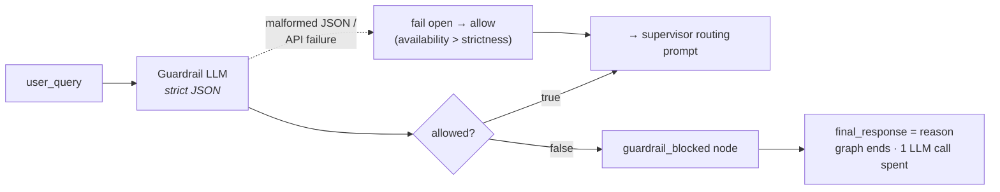
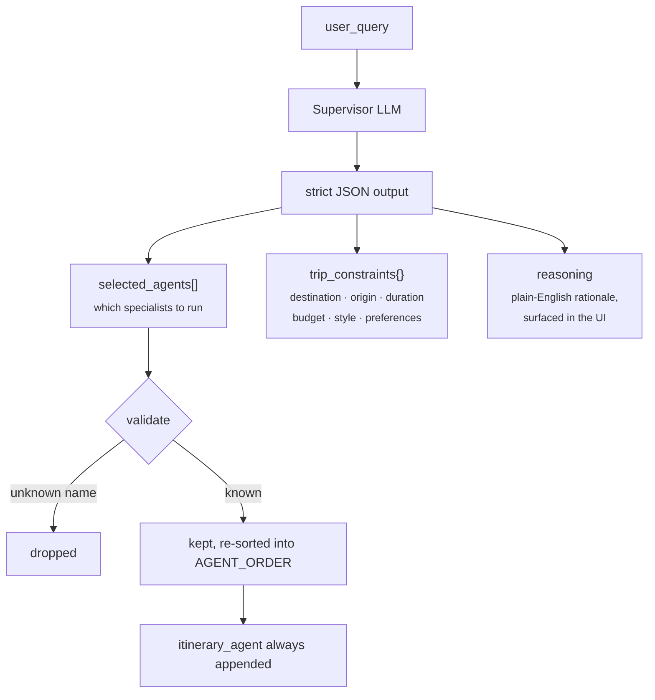
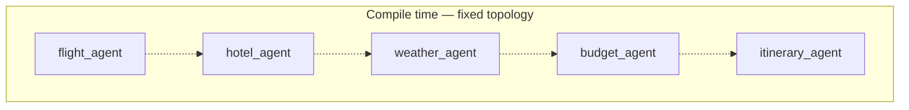
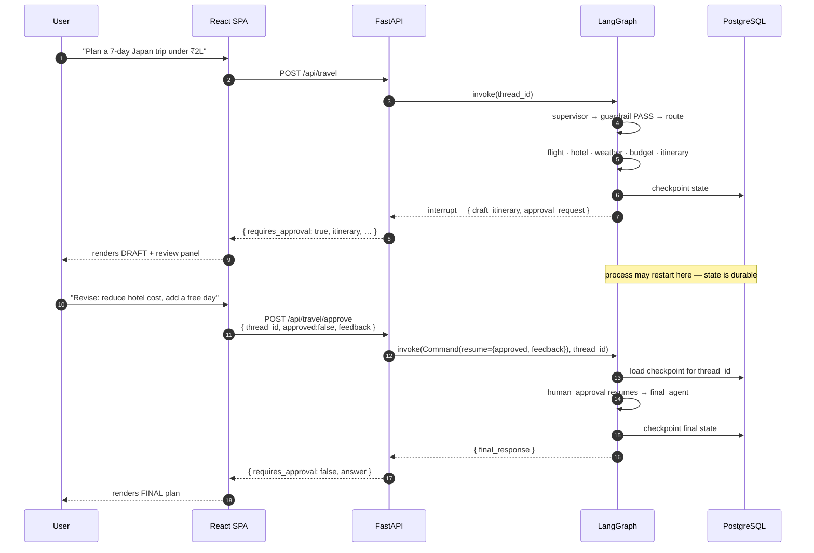

[← README](../README.md) &nbsp;·&nbsp; [Getting Started](getting-started.md) &nbsp;·&nbsp; [Architecture](architecture.md) &nbsp;·&nbsp; **The Agent Layers** &nbsp;·&nbsp; [The MCP Tool Fabric](mcp.md) &nbsp;·&nbsp; [Frontend](frontend.md) &nbsp;·&nbsp; [API Reference](api.md) &nbsp;·&nbsp; [Design Notes](design-notes.md)

---

# The Agent Layers

*The guardrail, the supervisor, dynamic routing, and the human-in-the-loop interrupt.*

Four layers sit between a raw sentence and a finished plan. Each one is a decision the system
makes *about* the request before doing any of the work the request asked for.

| | Layer | Decides |
| :-: | --- | --- |
| 1 | [Input Guardrail](#-layer-1--input-guardrail) | Should this request be answered at all? |
| 2 | [The Supervisor Agent](#-layer-2--the-supervisor-agent) | Which specialists does it need, and under what constraints? |
| 3 | [Dynamic Routing](#-layer-3--dynamic-routing) | In what order do those specialists actually run? |
| 4 | [Human-in-the-Loop](#-layer-4--human-in-the-loop-interrupt) | Is the draft good enough to finalise? |

> The specialists themselves reach the outside world through MCP servers — that layer is
> documented separately in **[The MCP Tool Fabric](mcp.md)**.

## 🛡 Layer 1 · Input Guardrail

The very first thing the supervisor node does is classify the request. It runs **before** routing,
before any tool call, and before any specialist LLM call.



The guardrail contract is a two-field JSON object:

```json
{ "allowed": true, "reason": "" }
```

Valid requests may concern *destinations, flights, hotels, weather, budgets, visas,
transportation, sightseeing, food, packing, or itineraries*. Anything else is refused with a
human-readable reason that flows straight through to the UI's **Guardrail blocked** badge.

**Design note — why fail open?** `_json_from_llm()` extracts the first complete JSON object from
the model's reply. If the model returns prose, or the API call fails, the code treats the request
as allowed rather than blocking it. For a travel planner, wrongly refusing a legitimate trip is a
worse failure than wastefully planning an odd one. A system with a stricter threat model would
invert that default.

---

## 🧠 Layer 2 · The Supervisor Agent

Once the request clears the guardrail, the same node runs a second, different prompt whose entire
job is to **write the workflow**.



The supervisor emits exactly this shape:

```json
{
  "selected_agents": ["flight_agent", "hotel_agent", "weather_agent", "budget_agent", "itinerary_agent"],
  "trip_constraints": {
    "destination": "Japan",
    "origin": "India",
    "duration": "7 days",
    "budget": "2 lakhs",
    "travel_style": "balanced",
    "special_preferences": ["sightseeing"]
  },
  "reasoning": "The request names a destination, an origin, a duration and a hard budget ceiling, and explicitly asks for flights, hotels and sightseeing — so all five specialists are required."
}
```

Three safeguards sit between that JSON and execution:

| Safeguard | What it prevents |
| --- | --- |
| **Membership filter** against `KNOWN_AGENTS` | A hallucinated agent name (`"visa_agent"`) silently becoming a routing target. |
| **Re-sort into `AGENT_ORDER`** | The model returning agents in an order that would let the budget agent run before flight data exists. |
| **`itinerary_agent` always forced in** | A request that skips the composer and produces no plan at all. |

Because `reasoning` is returned all the way to the client, the UI can show *why* those agents ran
— the routing decision is auditable by the end user, not just by the developer reading logs.

**Cost impact.** A "what's the weather in Bali?" request selects `weather_agent` +
`itinerary_agent`, so the graph makes ~3 LLM calls instead of ~7 and issues one MCP call instead
of four. The `llm_calls` counter in every response makes that saving measurable rather than
theoretical.

---

## 🔀 Layer 3 · Dynamic Routing

LangGraph needs a static topology at compile time, but the *path taken through it* is decided per
request. VoyaGen resolves that with conditional edges over a fixed order.



```python
AGENT_ORDER = [
    "flight_agent", "hotel_agent", "weather_agent",
    "budget_agent", "itinerary_agent",
]

def route_after_agent(current_agent: str):
    def route(state: TravelState) -> str:
        selected = [a for a in AGENT_ORDER if a in state.get("selected_agents", [])]
        i = AGENT_ORDER.index(current_agent)
        for nxt in AGENT_ORDER[i + 1:]:      # walk forward…
            if nxt in selected:              # …to the next *selected* agent
                return nxt
        return "itinerary_agent"             # …or fall through to the composer
    return route
```

Three requests, three different paths through the same compiled graph:

| Request | `selected_agents` | Executed path |
| --- | --- | --- |
| *"Plan a 7-day Japan trip under ₹2L"* | all five | `flight → hotel → weather → budget → itinerary` |
| *"What's the weather in Bali in July?"* | `weather`, `itinerary` | `weather → itinerary` |
| *"Cheap hotels near Shibuya?"* | `hotel`, `itinerary` | `hotel → itinerary` |

Ordering is intentional and load-bearing: retrieval agents (flight, hotel, weather) run first
because the **budget agent reads their output**, and the itinerary agent reads everything.

---

## 👤 Layer 4 · Human-in-the-Loop Interrupt

This is the part that most distinguishes VoyaGen from a chained-prompt demo. The pause is a
**real LangGraph interrupt**, not a UI-side confirmation modal.



The node itself is remarkably small — the interrupt payload *is* the API contract:

```python
def human_approval_agent(state: TravelState):
    review = interrupt({
        "question": "Do you approve this itinerary?",
        "draft_itinerary": state.get("itinerary", ""),
        "approval_request": state.get("approval_request", ""),
        "selected_agents": state.get("selected_agents", []),
        "supervisor_reasoning": state.get("supervisor_reasoning", ""),
        "expected_response": {"approved": True, "feedback": "Optional revision feedback"},
    })
    return {
        "approved": bool(review.get("approved", False)),
        "human_feedback": str(review.get("feedback", "")).strip(),
    }
```

And the final agent branches on the verdict:

| Verdict | Instruction injected into the final prompt |
| --- | --- |
| `approved: true` | *"The user approved the draft. Preserve its decisions while polishing it."* |
| `approved: false` | *"The user requested a revision. Apply this feedback carefully: `<feedback>`"* |

**Why this needs durable checkpointing.** The pause can last minutes or days. Without
`PostgresSaver`, a restart between the draft and the approval would lose the thread entirely. The
checkpointer is not an optimisation here — it is what makes the feature possible.

**What the UI enforces on top.** While `phase === "awaiting_approval"`, the composer is locked and
explains why, and *Revise* stays disabled until feedback is non-empty — mirroring the server-side
`400` that rejects a rejection with no feedback.

---

<div align="center">

← [Architecture](architecture.md) &nbsp;•&nbsp; [The MCP Tool Fabric](mcp.md) →

</div>
