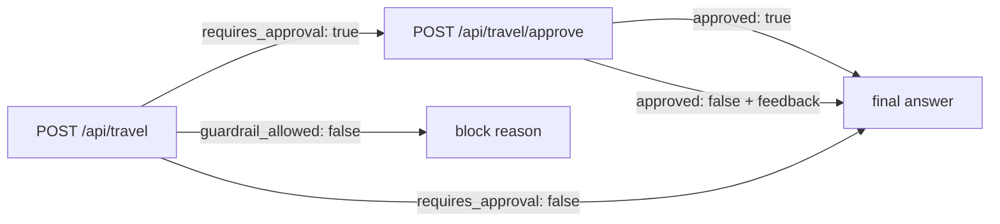

[← README](../README.md) &nbsp;·&nbsp; [Getting Started](getting-started.md) &nbsp;·&nbsp; [Architecture](architecture.md) &nbsp;·&nbsp; [The Agent Layers](agents.md) &nbsp;·&nbsp; [The MCP Tool Fabric](mcp.md) &nbsp;·&nbsp; [Frontend](frontend.md) &nbsp;·&nbsp; **API Reference** &nbsp;·&nbsp; [Design Notes](design-notes.md)

---

# API Reference

*Both endpoints, the full response contract, and an end-to-end walkthrough.*

## 📡 API Reference

Two endpoints: one starts a run, one resumes a paused one.



### `POST /api/travel`

Starts (or continues) a thread. Runs guardrail → supervisor → selected specialists → itinerary,
then pauses at the human-approval interrupt.

**Request**

```json
{
  "message": "Plan a complete 7 day Japan trip from India under 2 lakhs",
  "thread_id": "b1f0c9d2-4a77-4f31-9c2e-77aa10bb44de"
}
```

| Field | Type | Required | Notes |
| --- | --- | :-: | --- |
| `message` | `string` | ✅ | The natural-language travel request. Empty/whitespace-only → `400`. |
| `thread_id` | `string \| null` | ➖ | Omit to start a new thread; a UUID is generated and returned. |

**Response `200`**

```json
{
  "success": true,
  "thread_id": "b1f0c9d2-4a77-4f31-9c2e-77aa10bb44de",
  "answer": "## Trip Summary\n…",
  "requires_approval": true,
  "approval_request": "Please review the generated draft itinerary…",
  "itinerary": "## Trip Summary\n…",
  "flight_results": "Likely departure airport: DEL…",
  "hotel_results": "1. **Best Hotels in Tokyo** …",
  "weather_results": "Current Weather:\n{…}\n\nForecast:\n{…}",
  "budget_results": "Estimated cost categories…",
  "selected_agents": ["flight_agent", "hotel_agent", "weather_agent", "budget_agent", "itinerary_agent"],
  "trip_constraints": {
    "destination": "Japan", "origin": "India", "duration": "7 days",
    "budget": "2 lakhs", "travel_style": "", "special_preferences": ["sightseeing"]
  },
  "supervisor_reasoning": "The request names a destination, an origin, a duration and a hard budget ceiling…",
  "guardrail_allowed": true,
  "guardrail_reason": "",
  "approved": null,
  "human_feedback": "",
  "llm_calls": 6
}
```

| Field | Meaning |
| --- | --- |
| `answer` | The draft itinerary while `requires_approval` is `true`; the final plan afterwards. |
| `requires_approval` | `true` when the graph is paused at the HITL interrupt. |
| `selected_agents` / `supervisor_reasoning` | The supervisor's routing decision and its rationale. |
| `guardrail_allowed` / `guardrail_reason` | The guardrail verdict. When `false`, no specialist ran. |
| `flight_results` … `budget_results` | Raw per-agent artifacts, for debugging and per-agent inspection. |
| `llm_calls` | Cumulative model calls for the thread. |

Returning the intermediates — not just `answer` — is intentional: a poor final answer can be
attributed to bad retrieval versus bad synthesis without re-running anything.

### `POST /api/travel/approve`

Resumes a paused thread with the human's verdict.

**Request**

```json
{
  "thread_id": "b1f0c9d2-4a77-4f31-9c2e-77aa10bb44de",
  "approved": false,
  "feedback": "Reduce the hotel cost and leave Day 4 open."
}
```

| Field | Type | Required | Notes |
| --- | --- | :-: | --- |
| `thread_id` | `string` | ✅ | Must reference a thread paused at the interrupt. |
| `approved` | `boolean` | ✅ | `true` polishes the draft; `false` revises it against `feedback`. |
| `feedback` | `string` | ➖ | **Required when `approved` is `false`** — otherwise `400`. |

The response has the same shape as above, with `requires_approval: false`, `answer` holding the
final plan, and `approved` / `human_feedback` echoing the decision.

### `GET /health`

```json
{
  "status": "ok",
  "message": "VoyaGen AI API is running",
  "features": ["supervisor_agent", "input_guardrail", "mcp_tool_fabric", "human_in_the_loop"],
  "frontend": "react"
}
```

`frontend` is `"react"` when `frontend/dist` exists and `"legacy_template"` otherwise — a cheap
way to confirm a deploy actually shipped the built UI. The React client polls this endpoint every
30 seconds to drive its API online/offline pill.

### Error responses

| Status | Body | Cause |
| --- | --- | --- |
| `400` | `{ "success": false, "error": "Message cannot be empty." }` | Blank `message` |
| `400` | `{ "success": false, "error": "Please provide revision feedback when rejecting the draft." }` | `approved: false` with no `feedback` |
| `500` | `{ "success": false, "error": "<exception text>" }` | Upstream API, MCP, or database failure (logged with a full traceback server-side) |

### Quick cURL walkthrough

```bash
# 1 · start a plan — returns requires_approval: true
curl -s -X POST http://127.0.0.1:8000/api/travel \
  -H "Content-Type: application/json" \
  -d '{"message":"Plan a 5 day Thailand trip from India under 1 lakh"}' | jq

# 2 · resume it with feedback
curl -s -X POST http://127.0.0.1:8000/api/travel/approve \
  -H "Content-Type: application/json" \
  -d '{"thread_id":"<id from step 1>","approved":false,"feedback":"Add two beach days."}' | jq
```

---

## 🧭 Example Walkthrough

**Input**

> *"Plan a complete 7 days Japan trip from India including flights, hotels and sightseeing under 2 lakhs"*

| Step | Node | What happens |
| :-: | --- | --- |
| 1 | `supervisor` (guardrail) | Classifies the request as travel-domain → `{"allowed": true}`. **1 LLM call.** |
| 2 | `supervisor` (routing) | Extracts `destination: Japan`, `origin: India`, `duration: 7 days`, `budget: 2 lakhs`; selects all five specialists; writes a plain-English rationale. **2 LLM calls.** |
| 3 | `flight_agent` | Calls `list_airports` and `list_airlines` over the AviationStack MCP server, truncates each payload to 3 000 chars, and prompts the LLM for departure/arrival airports, carriers, duration, fare range, peak-season warning and booking advice. **3 LLM calls.** |
| 4 | `hotel_agent` | Issues `"Best hotels for <query>"` to the Tavily MCP server; live, cited results land in `hotel_results`. **4 LLM calls.** |
| 5 | `weather_agent` | `extract_destination()` reduces the sentence to `"Japan"`, then calls `get_current_weather` and `get_forecast` on the custom weather MCP server. |
| 6 | `budget_agent` | Reads flights, hotels, weather and the ₹2 L ceiling → cost categories, risk areas, savings levers, feasibility verdict. **5 LLM calls.** |
| 7 | `itinerary_agent` | Composes the day-by-day draft and sets `approval_request`. **6 LLM calls.** |
| 8 | `human_approval` | **⏸ `interrupt()`.** State is checkpointed to PostgreSQL; the API returns `requires_approval: true`; the UI renders the draft with a **DRAFT** badge and locks the composer. |
| 9 | *You* | *"Reduce the hotel cost and leave Day 4 open."* → `POST /api/travel/approve` with `approved: false`. |
| 10 | `final_agent` | Resumes with `Command(resume=…)`, applies the feedback, and emits the seven-section plan. **7 LLM calls.** |
| 11 | Checkpointer | Final state persisted under the thread ID; the client keeps it in `localStorage`. |

**Output** — markdown rendered in-browser with a trip summary, flight guidance, a cited hotel
shortlist, weather and packing advice, a day-by-day plan, an estimated budget table, and closing
recommendations. Copy to clipboard, or export a light-themed PDF.

---

<div align="center">

← [Frontend](frontend.md) &nbsp;•&nbsp; [Design Notes](design-notes.md) →

</div>
