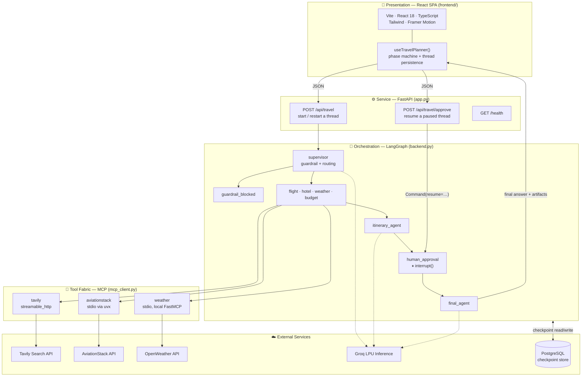
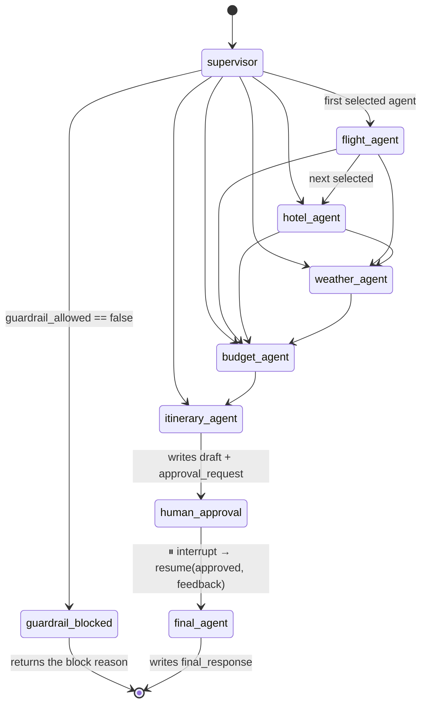
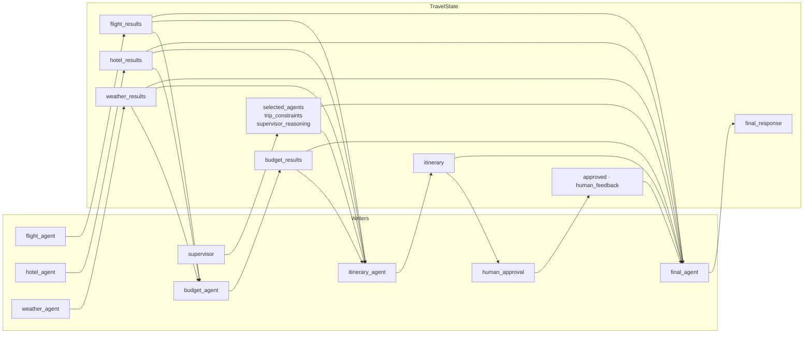
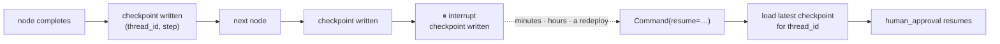
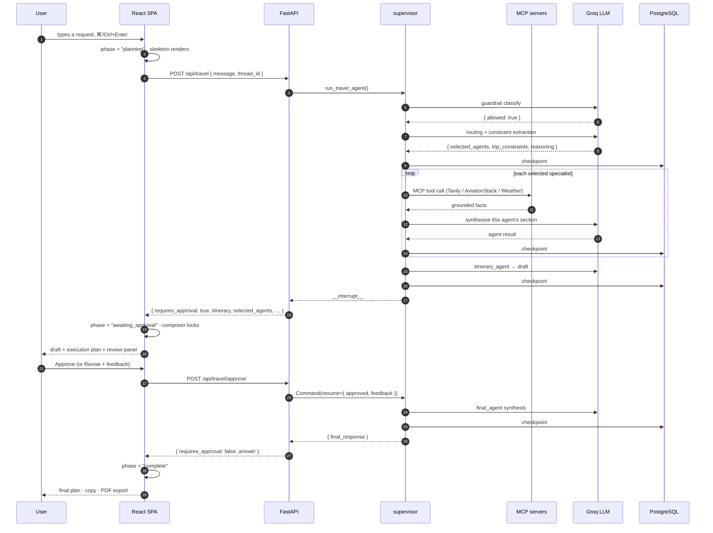

[← README](../README.md) &nbsp;·&nbsp; [Getting Started](getting-started.md) &nbsp;·&nbsp; **Architecture** &nbsp;·&nbsp; [The Agent Layers](agents.md) &nbsp;·&nbsp; [The MCP Tool Fabric](mcp.md) &nbsp;·&nbsp; [Frontend](frontend.md) &nbsp;·&nbsp; [API Reference](api.md) &nbsp;·&nbsp; [Design Notes](design-notes.md)

---

# Architecture

*How the system is layered, how the graph is wired, and how state moves through it.*

## 🏛 System Architecture

The system is deliberately layered so each concern can be tested, replaced, or scaled in
isolation.



**Why these boundaries:**

1. **Presentation** — a typed React client that knows only the JSON contract. It holds a phase
   machine (`idle → planning → awaiting_approval → finalising → complete`) mirroring the graph,
   so the UI can never show an approve button for a thread that isn't paused.
2. **Service** — FastAPI owns request validation (`pydantic` models), the error boundary, and
   the two-endpoint contract. It contains no travel logic.
3. **Orchestration** — LangGraph owns control flow, state reduction, interrupts, and persistence.
4. **Tool fabric** — every external fact enters through an MCP server. Swapping AviationStack for
   Amadeus means changing one server entry, not touching an agent.

---

## 🗺 End-to-End Architecture Diagram

A wider view of the same system — the guardrail, the supervisor, each specialist with the MCP
server behind it, how their outputs land in the shared `TravelState`, the human review gate, and
how everything is persisted:

<div align="center">
  
</div>

**Reading this diagram:**

- **Nothing runs before the guardrail.** A blocked request never reaches the supervisor, so an
  off-domain prompt costs exactly one LLM call.
- **The supervisor writes the workflow, the graph executes it.** `selected_agents` is data, not
  code — which is why adding a sixth specialist requires a node, a routing entry, and one line
  in the supervisor prompt, and nothing else.
- **Every agent writes into the *same* `TravelState`** rather than passing messages
  point-to-point. That is what lets the budget agent read flight and hotel results fetched two
  steps earlier without re-fetching, and the final agent see all of it at once.
- **The human sits inside the graph, not beside it.** Review happens at a checkpointed pause
  between the draft and the final synthesis — the plan the user approves is the plan that gets
  polished.
- **State is checkpointed after each step**, so a restart mid-run resumes from the last completed
  node instead of losing the conversation.

---

## 🕸 The Agent Graph



> Every specialist edge is a **conditional edge**. `route_after_agent(current)` walks the fixed
> `AGENT_ORDER` list forward from the current node and jumps to the next agent that is present in
> `selected_agents`, falling through to `itinerary_agent` when none remain. The order is fixed —
> the *membership* is dynamic.

### Node responsibilities

| Node | Reads from state | Tool / model | Writes to state |
| --- | --- | --- | --- |
| **`supervisor`** | `user_query` | Groq LLM ×2 (guardrail + routing) | `guardrail_allowed`, `guardrail_reason`, `selected_agents`, `trip_constraints`, `supervisor_reasoning` |
| **`guardrail_blocked`** | `guardrail_reason` | — | `final_response` |
| **`flight_agent`** | `user_query` | AviationStack MCP (`list_airports`, `list_airlines`) → Groq LLM | `flight_results` |
| **`hotel_agent`** | `user_query` | Tavily MCP (`tavily_search`) | `hotel_results` |
| **`weather_agent`** | `user_query` | Weather MCP (`get_current_weather`, `get_forecast`) | `weather_results` |
| **`budget_agent`** | query, constraints, flight/hotel/weather results | Groq LLM, *"practical travel budget analyst"* | `budget_results` |
| **`itinerary_agent`** | everything above | Groq LLM, *"expert travel planner"* | `itinerary`, `approval_request` |
| **`human_approval`** | `itinerary`, `approval_request` | **`interrupt()`** — no model call | `approved`, `human_feedback` |
| **`final_agent`** | everything, incl. the human's verdict | Groq LLM, *"professional travel booking assistant"* | `final_response` |

**Why separate `itinerary_agent` and `final_agent`?** Splitting *reasoning over noisy retrieval*
from *formatting to a strict seven-section contract* keeps each prompt short and single-purpose,
so section formatting and constraint-following are not competing for attention inside one long
instruction. It also creates the natural seam where the human review belongs: the draft is
substantive enough to judge, and the final pass is cheap enough to re-run against feedback.

---

## 🧬 State Design

Every node communicates through one typed dictionary. LangGraph merges each node's partial return
into the running state.

```python
class TravelState(TypedDict, total=False):
    messages: Annotated[list[AnyMessage], operator.add]   # append-only chat log

    user_query: str

    # Supervisor + guardrail
    guardrail_allowed: bool
    guardrail_reason: str
    selected_agents: list[str]
    trip_constraints: dict[str, Any]
    supervisor_reasoning: str

    # Specialist results
    flight_results: str
    hotel_results: str
    weather_results: str
    budget_results: str
    itinerary: str

    # Human-in-the-loop
    approval_request: str
    approved: bool
    human_feedback: str

    # Output + observability
    final_response: str
    llm_calls: int
```



Three details worth calling out:

- **`Annotated[list[AnyMessage], operator.add]`** makes `messages` an *append-only reducer*.
  Nodes return only what they add; LangGraph concatenates rather than overwrites. Every other
  field uses last-write-wins, which is exactly right for single-writer fields.
- **`total=False`** means every key is optional, so a guardrail-blocked run — which never
  populates `flight_results` — is a perfectly valid state rather than a type error.
- **`llm_calls`** is incremented by every model-calling node, giving a cheap cost signal that is
  surfaced all the way into the API response and rendered in the UI's execution-plan header.

---

## 💾 Persistence & Checkpointing

```python
DATABASE_URL = get_database_url()        # appends sslmode=require when absent

_pool = ConnectionPool(
    conninfo=DATABASE_URL,
    min_size=1,
    max_size=int(os.getenv("DB_POOL_MAX_SIZE", "10")),
    kwargs={
        "autocommit": True,              # PostgresSaver drives its own transactions
        "row_factory": dict_row,         # checkpoint deserialisation needs dict rows
        "prepare_threshold": 0,          # pooled conns are recycled across statements
    },
    open=True,
)

checkpointer = PostgresSaver(_pool)
checkpointer.setup()                     # idempotent schema migration
travel_graph = graph.compile(checkpointer=checkpointer)
```

**Why a pool and not a single connection.** A graph run holds its connection for the whole
request — six-plus LLM calls and several MCP round-trips — so one shared connection serialises
every concurrent request behind the slowest one. `PostgresSaver` accepts a `ConnectionPool`
directly, so this is a drop-in change. The pool is released from the FastAPI lifespan handler via
`backend.close_checkpointer()`.

Every invocation is scoped by `config={"configurable": {"thread_id": ...}}`. The React client
stores its `thread_id` in `localStorage`, so a returning user resumes the same durable thread —
and, critically, so does a paused approval.



The connection helper appends `sslmode=require` automatically when the URL omits it — a small
guard that matters for managed Postgres providers such as Render, Neon, and Supabase.

---

## 🔄 Request Lifecycle

The complete happy path, front to back:



---

<div align="center">

← [Getting Started](getting-started.md) &nbsp;•&nbsp; [The Agent Layers](agents.md) →

</div>
