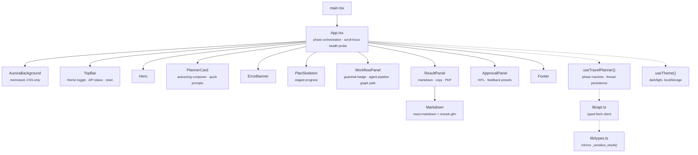
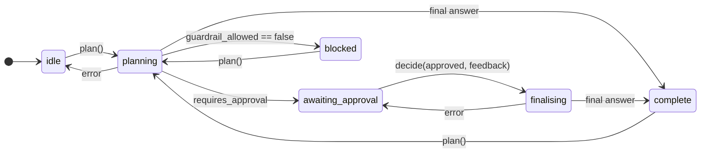

[← README](../README.md) &nbsp;·&nbsp; [Getting Started](getting-started.md) &nbsp;·&nbsp; [Architecture](architecture.md) &nbsp;·&nbsp; [The Agent Layers](agents.md) &nbsp;·&nbsp; [The MCP Tool Fabric](mcp.md) &nbsp;·&nbsp; **Frontend** &nbsp;·&nbsp; [API Reference](api.md) &nbsp;·&nbsp; [Design Notes](design-notes.md)

---

# Frontend

*The React SPA: phase machine, component tree, and design system.*

## 🎨 Frontend Architecture

The front end is a **Vite + React 18 + TypeScript** SPA in `frontend/`, styled with Tailwind and
animated with Framer Motion. It is a rewrite of the original Jinja2 + vanilla-JS page, built to
mirror the graph's phases rather than just render its output.



### The phase machine

`useTravelPlanner()` owns all planner state and exposes exactly one legal transition per phase —
which is what keeps impossible UI states unreachable:



Consequences the user actually feels:

- The composer **locks** in `awaiting_approval` and explains why, so a second plan cannot be
  started on a thread the server has paused.
- **Revise** stays disabled until feedback is non-empty, mirroring the server's `400`.
- An `inFlight` ref plus a `phaseRef` guard prevents double submits and stale-closure races.
- Errors return the machine to a phase the user can act from — a failed approval lands back in
  `awaiting_approval`, not in `idle` with the draft orphaned.

### Notable implementation details

| Detail | Why |
| --- | --- |
| **Typed API contract** | `lib/types.ts` mirrors `backend._serialize_result()` field for field, so a backend rename becomes a compile error rather than a blank panel. |
| **Lazy PDF export** | `html2pdf.js` (~670 kB) is `import()`-ed only when Download is clicked, keeping it out of the initial bundle. |
| **Light-forced PDF** | The export toggles a `.pdf-light` class so the snapshot is readable on white paper even when the UI is dark. |
| **Memoised background** | `AuroraBackground` is CSS-animated and `memo`-wrapped, so re-renders during planning cost nothing. |
| **`prefers-reduced-motion`** | A global media query collapses every animation to ~0 ms. |
| **Honest progress** | The backend does not stream, so `PlanSkeleton` shows *named graph stages*, never a fake percentage. |
| **Health probe** | `GET /health` every 30 s drives the API online/offline pill. |
| **Accessible focus** | A visible `:focus-visible` ring, real `<label>`s, `role="alert"` on errors, and semantic `<ol>` for the pipeline. |

---

## 🎨 Design System

Every colour is a CSS custom property defined once on `:root` and swapped under `html.light`, so
the two themes are a token swap apart rather than two stylesheets.

```css
:root {                      /* dark — the default */
  --bg-base:  5 6 12;
  --text-hi:  244 246 255;
  --accent:   62 232 255;    /* cyan   */
  --accent-2: 139 92 246;    /* violet */
  --accent-3: 232 121 249;   /* magenta */
  --ok: 52 229 176;  --warn: 251 191 36;  --danger: 251 113 133;
}
html.light { --bg-base: 246 247 251; --text-hi: 12 16 32; --accent: 8 118 152; /* … */ }
```

Channel-triplet values (rather than `#hex`) let any token be used at any opacity —
`rgb(var(--accent) / 0.14)` — which is what makes the glass surfaces and coloured agent nodes
possible from a single palette.

| Layer | Treatment |
| --- | --- |
| **Backdrop** | Four drifting aurora blobs (26 s loop, staggered), a perspective grid, an SVG grain overlay, and a vignette — all CSS, no canvas, no JS per frame. |
| **Surfaces** | `.glass` / `.glass-strong` — `backdrop-filter: blur(22px) saturate(160%)`, hairline inset highlight, deep ambient shadow. |
| **Focus** | `.conic-border` — an animated conic-gradient ring driven by an `@property --angle` that activates when the composer is focused or busy. |
| **Typography** | Plus Jakarta Sans (UI), JetBrains Mono (ids, graph path, counters), with full system fallbacks. |
| **Motion** | Framer Motion for enter/exit and layout; one shared spring curve, `cubic-bezier(0.16, 1, 0.3, 1)`. |
| **Agent colours** | Each specialist owns an RGB triplet used for its icon, border, glow and connector — so the pipeline is readable at a glance without a legend. |

---

<div align="center">

← [The MCP Tool Fabric](mcp.md) &nbsp;•&nbsp; [API Reference](api.md) →

</div>
