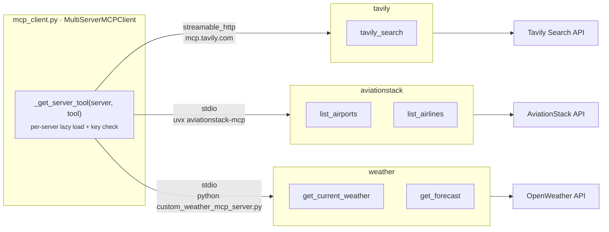

[← README](../README.md) &nbsp;·&nbsp; [Getting Started](getting-started.md) &nbsp;·&nbsp; [Architecture](architecture.md) &nbsp;·&nbsp; [The Agent Layers](agents.md) &nbsp;·&nbsp; **The MCP Tool Fabric** &nbsp;·&nbsp; [Frontend](frontend.md) &nbsp;·&nbsp; [API Reference](api.md) &nbsp;·&nbsp; [Design Notes](design-notes.md)

---

# The MCP Tool Fabric

*Three Model Context Protocol servers across two transports — and what happens when one is down.*

## 🔌 Overview

All external facts enter through [Model Context Protocol](https://modelcontextprotocol.io/)
servers, managed by a single `MultiServerMCPClient` in `mcp_client.py`. Three servers, three
different transports — deliberately, to prove the abstraction holds.



| Server | Transport | Process | Tools used |
| --- | --- | --- | --- |
| **tavily** | `streamable_http` | Hosted at `mcp.tavily.com` | `tavily_search` |
| **aviationstack** | `stdio` | Spawned via `uvx aviationstack-mcp` | `list_airports`, `list_airlines` |
| **weather** | `stdio` | Local `custom_weather_mcp_server.py`, run with `sys.executable` | `get_current_weather`, `get_forecast` |

### Why per-server lazy loading matters

`_get_server_tool()` loads tools from **one** server at a time rather than eagerly connecting to
all three:

```python
tools = await client.get_tools(server_name=server_name)   # not get_tools() for everything
```

This is the difference between *one* degraded capability and *total* failure. If `uvx` is not on
`PATH`, or the OpenWeather key is missing, the hotel agent still returns live Tavily results. Each
agent additionally wraps its call in a `try/except` that substitutes an **explicit, honest
fallback string** into state:

```python
hotel_results = (
    "Live hotel search is temporarily unavailable. Provide general accommodation "
    "and neighborhood guidance based on the destination and clearly label it as "
    "non-live advice."
)
```

That string is not an error message for a log — it is an instruction that flows into the
downstream prompt. The model is told to degrade *and to say that it degraded*, so a partial
outage produces a labelled, lower-confidence plan instead of a confident fabrication.

### The custom weather server

`custom_weather_mcp_server.py` is a ~60-line **FastMCP** server, included to demonstrate authoring
an MCP server rather than only consuming them:

```python
mcp = FastMCP("Weather MCP Server")

@mcp.tool()
def get_current_weather(city: str):
    ...  # OpenWeather /weather → {city, temperature_c, feels_like_c, humidity, condition, wind_speed}

@mcp.tool()
def get_forecast(city: str):
    ...  # OpenWeather /forecast → first 5 slots as {datetime, temperature, weather}
```

The weather agent first calls `extract_destination()` — a tiny single-purpose LLM call that
reduces *"Plan a 7 day Japan trip from Bangladesh under 2 lakhs"* to `"Japan"` — because the
OpenWeather API needs a place name, not a sentence.

---

<div align="center">

← [The Agent Layers](agents.md) &nbsp;•&nbsp; [Frontend](frontend.md) →

</div>
